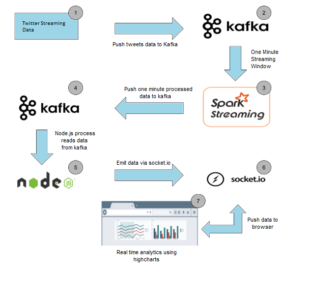
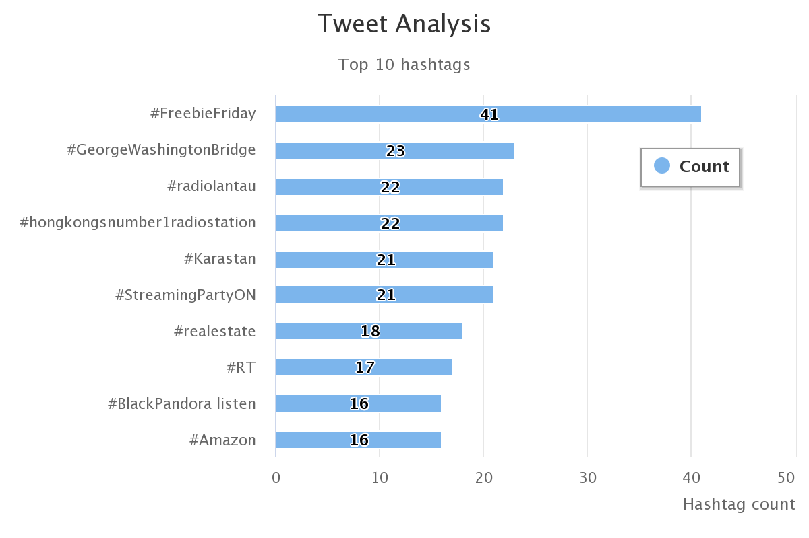

# Tweet Analysis using Kafka and Spark Streaming

Built a real-time analytics dashboard to visualize the trending hashtags at a given location by using real time streaming twitter API to get data.

#### Apache Kafka 
Kafka is a distributed streaming platform that is used publish and subscribe to streams of records. Kafka is used for fault tolerant storage. Kafka replicates topic log partitions to multiple servers. Kafka is designed to allow your apps to process records as they occur. It is a publish subscribe durable messaging system which allows decoupling of data streams.
#### Apache Spark
Apache Spark is a fast general purpose cluster computing system for large scale data processing. It is suitable for both batch based and real-time processing. It is a single unified framework which gives flexibility. Spark provides an interface for programming entire clusters with implicit data parallelism and fault tolerance.

 

## Technology stack

  

<table>
<thead>
<tr>
<th>Area</th>
<th>Technology</th>
</tr>
</thead>
<tbody>
	<tr>
		<td>Front-End</td>
		<td> HTML5, Bootstrap, CSS3, Socket.IO, highcharts.js </td>
	</tr>
	<tr>
		<td>Back-End</td>
		<td>Express, Node.js</td>
	</tr>
  <tr>
		<td>Cluster Computing Framework</td>
		<td>Apache Spark (python)</td>
	</tr>
	<tr>
		<td>Message Broker</td>
		<td>Apache kafka</td>
	</tr>
</tbody>
</table>

 

## Architecture

 

 

## How it works
<ol>
    <li>Extract data from Twitter's streaming API and put it into Kakfa topic.</li>
    <li>Spark is listening to this topic, it will read the data from topic, analyze it is using spark streaming and put top 10 trending hashtags into another kafka topic.</li>
    <li>Spark Streaming creates DStream whenever it read the data from kafka and analyze it by performing operation like map, filter, updateStateByKey, countByValues and forEachRDD on the RDD and top 10 hashtags are obtained from RDD using SparkSQL.</li>
    <li>Node.js will pick up the this data from kafka topic on server side and emit it to the socket.</li>
    <li>Socket will push data to user's dashboard which is rendered using highcharts.js in realtime.</li>
    <li>The dashboard is refreshed every 60 secs.</li>
</ol>

 

 

